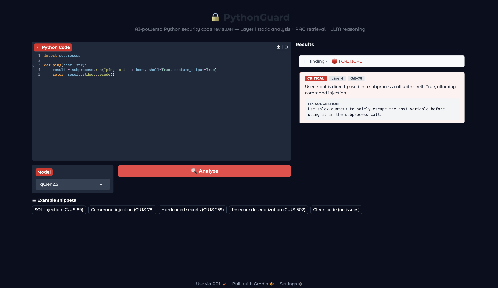

# PythonGuard

**A Security-Focused RAG System for Automated Python Code Review**

PythonGuard is a three-layer pipeline that combines deterministic static analysis, dense retrieval over authoritative security corpora, and a locally hosted quantized LLM to produce grounded, citation-backed security findings for Python code. Every finding is anchored in either a static-analysis hit or a retrieved rule — the LLM never reports a vulnerability it cannot cite.

> CS 455 — Large Language Models, Sabancı University, Spring 2025/2026  
> Ramazan Yıldırım · Arman İbrişim

---

## Results

Evaluated on the [SecurityEval](https://github.com/s2e-lab/SecurityEval) benchmark (121 vulnerable Python snippets, 69 unique CWEs) and 50 clean HumanEvalPack functions:

| System | Recall-CWE | Recall-Any | FPR | CiteFaith |
|---|---|---|---|---|
| Zero-shot LLM (no RAG) | 12.4% | — | — | — |
| Static analysis only (Bandit + pylint + H001–15) | 52.9% | — | — | — |
| **PythonGuard** | **75.2%** | **77.7%** | **0.0%** | **86.6%** |

**+62.8 pp** over zero-shot LLM · **+22.3 pp** over static-analysis only · **zero false positives** on 50 clean snippets.

---

## Demo



---

## How It Works

```
Input Python code
        │
        ▼
┌─────────────────────────────────────────────────────┐
│  Layer 1 — Static Analysis                          │
│  Bandit + pylint (fatal/error) + 15 AST heuristics  │
└─────────────────────────────────────────────────────┘
        │
        ▼
┌─────────────────────────────────────────────────────┐
│  Layer 2 — Parallel RAG Retrieval                   │
│  3 FAISS indexes  │  bi-encoder top-20  →  CE top-5 │
│  Semgrep · CWE · OWASP · PEPs · bug patterns        │
└─────────────────────────────────────────────────────┘
        │
        ▼
┌─────────────────────────────────────────────────────┐
│  Layer 3 — LLM Generation                           │
│  Qwen2.5-7B-Instruct Q4_K_M  │  temperature=0.0    │
│  JSON output with line, severity, fix, citation     │
└─────────────────────────────────────────────────────┘
        │
        ▼
Post-processing: filter · normalize citations · anchor Layer 1
        │
        ▼
Final findings (JSON array)
```

**Layer 1** runs Bandit, pylint (errors/fatals only), and 15 custom AST heuristics (H001–H015) covering XXE, JWT bypass, hardcoded keys, static IVs, log injection, TOCTOU, ReDoS, and more.

**Layer 2** retrieves from three FAISS `IndexFlatIP` indexes (12,104 total vectors): a security index (Semgrep + CWE XML + OWASP Cheat Sheets), a style index (PEP 8/257/484), and a bug-pattern index (Dahoas + Muennighoff datasets). Retrieval is two-stage: bi-encoder top-20 → cross-encoder rerank to top-5.

**Layer 3** uses a locally quantized LLM (default: Qwen2.5-7B-Instruct Q4\_K\_M via `llama-cpp-python`) with a vocabulary-guided prompt built from Layer 1 findings and Layer 2 chunks. A three-stage JSON repair parser handles malformed output.

---

## Quick Start

### 1. Clone and install dependencies

```bash
git clone https://github.com/ramazanyildirim0/CS455-LLM-Cybersecurity-RAG
cd CS455-LLM-Cybersecurity-RAG
pip install -r requirements.txt
```

### 2. Download models

```bash
# Recommended: download Qwen2.5 only (~4 GB)
python3 download_llm_models.py --models qwen2.5

# Or download all three LLMs + encoders
python3 download_llm_models.py
```

Models are saved under `models/`. The FAISS indexes are already built and committed under `faiss_index/indexes/`.

If any HuggingFace model is gated, add your token to `.env`:
```
HF_TOKEN=hf_your_token_here
```

### 3. Launch the UI

```bash
python3 ui/app.py
```

Open **http://127.0.0.1:7860** in your browser.

Paste Python code, select a model (`qwen2.5`, `llama3.1`, or `mistral`), and click **Analyze**. Results appear as severity-tagged cards (CRITICAL / WARNING / INFO) with line numbers, CWE citations, explanations, and fix suggestions.

---

## Run from the Command Line

```bash
# Single file
python3 main.py path/to/your_script.py

# Specific model
python3 main.py path/to/your_script.py --model qwen2.5
```

---

## Reproduce the Evaluation

```bash
# Full evaluation: recall on SecurityEval + FPR on clean snippets + citation judge
python3 -m eval.harness --model qwen2.5

# Skip baselines for a faster run
python3 -m eval.harness --model qwen2.5 --skip-b1 --skip-b2

# Also run the No-Bandit ablation
python3 -m eval.harness --model qwen2.5 --ablation

# Resume an interrupted run
python3 -m eval.harness --model qwen2.5 --resume eval/results/progress.jsonl
```

---

## Project Structure

```
.
├── layer1/
│   └── static_analysis.py      # Bandit + pylint + 15 AST heuristics (H001–H015)
├── layer2/
│   └── retrieval.py            # Bi-encoder + cross-encoder retrieval
├── layer3/
│   ├── prompt_builder.py       # Prompt assembly
│   ├── llm_runner.py           # GGUF inference via llama-cpp-python
│   ├── review.py               # End-to-end pipeline + post-processing
│   └── benchmark.py            # Layer-3 model benchmark (19-marker test suite)
├── eval/
│   ├── harness.py              # Full evaluation harness (recall + FPR + CiteFaith)
│   ├── metrics.py              # Scoring functions + CWE equivalence map
│   ├── baselines.py            # B1 (zero-shot) and B2 (static-only) baselines
│   └── citation_judge.py       # LLM-as-judge for citation faithfulness
├── faiss_index/
│   ├── build_indexes.py        # Build all three FAISS indexes from JSONL
│   ├── indexes/                # Pre-built indexes (committed)
│   └── search.py               # Index loader
├── normalize/
│   ├── run_all.py              # Orchestrator for all normalizers
│   ├── normalize_semgrep.py
│   ├── normalize_cwe.py
│   ├── normalize_owasp.py
│   ├── normalize_peps.py
│   └── normalize_bug_patterns.py
├── dataset/
│   ├── security_semgrep.jsonl
│   ├── security_cwe.jsonl
│   ├── security_owasp.jsonl
│   ├── style_peps.jsonl
│   ├── bug_patterns.jsonl
│   └── test/                   # SecurityEval + HumanEvalPack eval sets
├── ui/
│   └── app.py                  # Gradio web UI
├── models/                     # Downloaded model weights (gitignored)
├── download_llm_models.py      # Download LLMs + encoders from HuggingFace
├── download_hf_datasets.py     # Download raw training corpora
└── main.py                     # CLI entry point
```

---

## Technology Stack

| Component | Choice |
|---|---|
| Static security linter | Bandit ≥ 1.7 |
| Static style linter | pylint ≥ 3.0 (fatal/error only) |
| AST heuristics | Custom Python (H001–H015) |
| Bi-encoder | all-MiniLM-L6-v2 (384-dim) |
| Cross-encoder | ms-marco-MiniLM-L-6-v2 |
| Vector index | FAISS `IndexFlatIP` |
| LLM (default) | Qwen2.5-7B-Instruct Q4\_K\_M |
| LLM runtime | `llama-cpp-python` (Apple Metal / CUDA) |
| Web UI | Gradio (Soft theme) |

All inference runs locally — no cloud APIs or paid services.

---

## Troubleshooting

| Error | Fix |
|---|---|
| `FileNotFoundError: .../all-MiniLM-L6-v2` | Run `python3 download_llm_models.py` |
| `FileNotFoundError: ...Q4_K_M.gguf` | Run `python3 download_llm_models.py --models qwen2.5` |
| First analysis very slow / high RAM | Expected — a 7B Q4 model takes 5–15 s to load and uses ~5 GB RAM |
| Port 7860 already in use | Edit `server_port` in `ui/app.py` |
| `bandit: command not found` | `pip install bandit` |
| `pylint: command not found` | `pip install pylint` |

---

## License

This project is for academic purposes (CS 455, Sabancı University). All underlying tools and datasets retain their original licenses.
